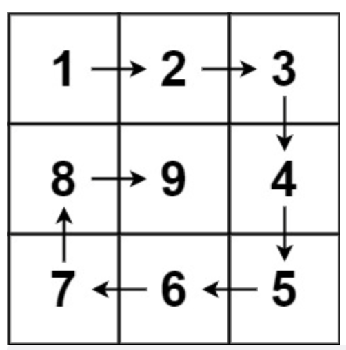

# 59. 螺旋矩阵 II

[leecode原题](https://leetcode.cn/problems/spiral-matrix-ii/)

## 题目
给你一个正整数 `n` ，生成一个包含 `1` 到 `n2` 所有元素，且元素按顺时针顺序螺旋排列的 `n x n` 正方形矩阵 `matrix` 。

## 示例

### 示例 1:


```text
输入：n = 3
输出：[[1,2,3],[8,9,4],[7,6,5]]
```

### 示例 2:

```text
输入：n = 1
输出：[[1]]
```

## 提示：
- 1 <= `n` <= 20

## 解题思路

### 思路

这个题直观上来看, 我们顺时针一圈(即从左到右、从上到下、从右到左、从下到上)即产生了一个顺时的矩阵外圈，然后该矩阵外圈的下一内圈也是按照同样的顺序即可产生。我们重点要注意的是: **比如从左到右完成，需要将上加一，这样从上到下的时候，不会重复产生那个顶点元素，其他方向规律是一样的。**

## 实现
[源码](./code/59-spiral-matrix-ii/main.go)
```go
func generateMatrix(n int) [][]int {
	var (
		spiral_matrix              = make([][]int, n) //螺旋矩阵
		spiral_matrix_elements_sum = n * n            // 螺旋矩阵元素总数

		left   = 0     // 左边起始位置
		right  = n - 1 // 右边起始位置
		top    = 0     // 上边起始位置
		bottom = n - 1 //下边起始位置

		current_num = 1 // 螺旋矩阵当前记录的元素(初始从1开始)
	)
	for i := 0; i < n; i++ {
		spiral_matrix[i] = make([]int, n)
	}

	for current_num <= spiral_matrix_elements_sum {
		// 从左到右
		for i := left; i <= right; i++ {
			spiral_matrix[top][i] = current_num
			current_num++
		}
		top++

		// 从上到下
		for i := top; i <= bottom; i++ {
			spiral_matrix[i][right] = current_num
			current_num++
		}
		right--

		// 从右到左
		for i := right; i >= left; i-- {
			spiral_matrix[bottom][i] = current_num
			current_num++
		}
		bottom--

		// 从下到上
		for i := bottom; i >= top; i-- {
			spiral_matrix[i][left] = current_num
			current_num++
		}
		left++
	}
	return spiral_matrix
}
```
