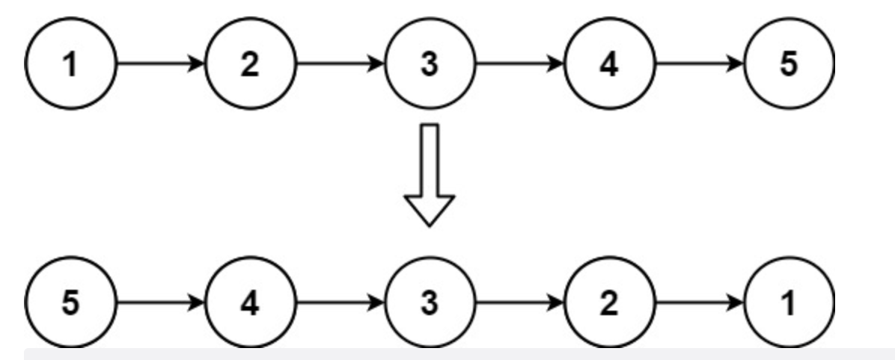

# 206. 反转链表

[leecode原题](https://leetcode.cn/problems/reverse-linked-list/)

## 题目
给你单链表的头节点 `head` ，请你反转链表，并返回反转后的链表。

## 示例

### 示例 1:

```text
输入：head = [1,2,3,4,5]
输出：[5,4,3,2,1]
```

### 示例 2:

```text
输入：head = [1,2]
输出：[2,1]
```

### 示例 3:
```text
输入：head = []
输出：[]
```

## 提示：

- 链表中节点的数目范围是 `[0, 5000]`
- -5000 <= `Node.val` <= 5000

## 进阶
链表可以选用迭代或递归方式完成反转。你能否用两种方法解决这道题？


## 解题思路

### 思路
我们可能第一时间想到的解决思路是再使用一个新的链表，然后遍历原链表，然后在新链表中每次插入链表头即完成了反转， 但是这必然会造成空间的浪费，所以**我们要考虑的还是去做到原地反转。**

仔细想一想, 其实遍历的时候，只需要把下个节点的next反向指向前一个节点，依次这样完成即可。不过，**需要注意的是: 遍历后头结点将变成尾结点，所以必须从头结点开始，且头结点的next指向nil.**

## 实现

[源码](./code/206-reverse-linked-list/main.go)

### 迭代法
```go
func reverseList(head *ListNode) *ListNode {
	// 重点是: cur_node初始化是从头结点, 然后pre_node是空指针
	cur_node := head
	var pre_node *ListNode
	for cur_node != nil {
		next_node := cur_node.Next
		cur_node.Next = pre_node
		pre_node = cur_node
		cur_node = next_node
	}
	return pre_node
}
```

### 递归法
```go
func reverseList1(head *ListNode) *ListNode {
	return reverse_dg(nil, head)
}

func reverse_dg(pre *ListNode, cur *ListNode) *ListNode {
	if cur == nil {
		return pre
	}
	next := cur.Next
	cur.Next = pre
	return reverse_dg(cur, next)
}
```