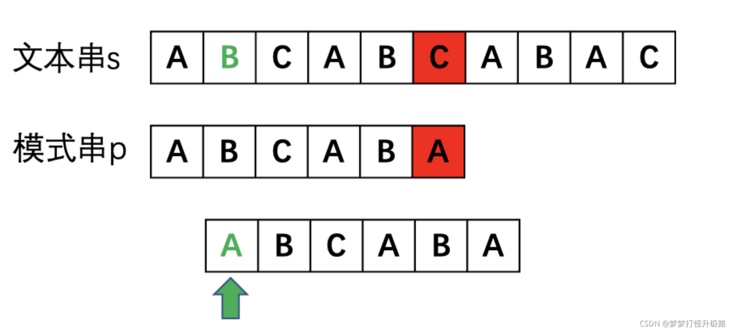
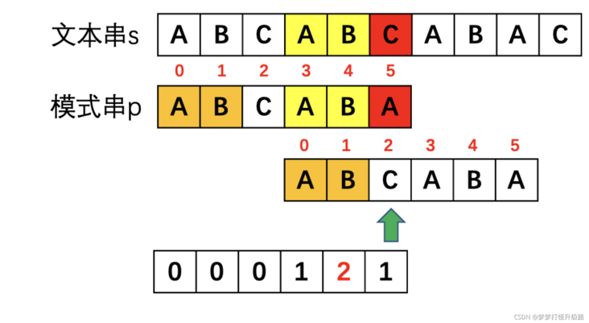
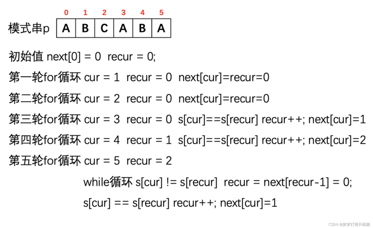
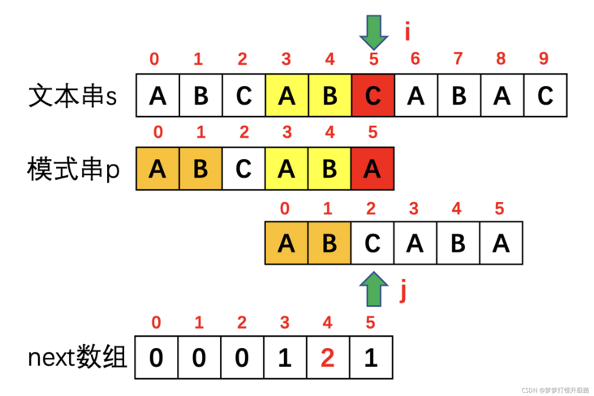

# 28. 实现 strStr()

[leecode原题](https://leetcode.cn/problems/implement-strstr/)

## 题目

实现 `strStr()` 函数。

给你两个字符串 `haystack` 和 `needle` ，请你在 `haystack` 字符串中找出 `needle `字符串出现的第一个位置（下标从 `0` 开始）。如果不存在，则返回  `-1` 。

说明：    
- 当 `needle` 是空字符串时，我们应当返回什么值呢？这是一个在面试中很好的问题。
- 对于本题而言，当 `needle` 是空字符串时我们应当返回 `0` 。这与 C 语言的 `strstr()` 以及 Java 的 `indexOf()` 定义相符。


## 示例

### 示例 1:

```text
输入：haystack = "hello", needle = "ll"
输出：2
```

### 示例 2:

```text
输入：haystack = "aaaaa", needle = "bba"
输出：-1
```


## 提示：
- `1 <= haystack.length, needle.length <= 104`
- `haystack` 和 `needle` 仅由小写英文字符组成

## 解题思路

### 思路
这里参考[小白KMP算法 讲清楚next数组生成代码](https://segmentfault.com/a/1190000040952095), 图文讲解还是很清晰的。

#### KMP算法的由来和本文术语解释
KMP算法的中文名称为快速模式匹配算法，是为了快速解决在一个字符串中查找另一个字符串的问题。（为了方便描述，要找到的那个字符串叫模式串，要搜索的那个范围叫文本串。比如要求在字符串`abbaf`中找到字符串`baf`，`baf`就是模式串，`abbaf`就是文本串）。

针对这种问题，我们其实很容易想到一种暴力的算法，那就是一个一个比。


不难发现，遇到不匹配的情况时，模式串每次都是傻傻的挪一下，然后再一位一位地去比较。

暴力太傻了吧，所以就有了`KMP`算法，让模式串迈开腿，能够大步往前走。但大步走也不是瞎走，不然走过了相等的村就没有相等的店了，得有点策略地走，于是有了`next`数组。这个数组的名字起的其实还是有点形象的，代表比到某一位不匹配了下一个比哪一位，像一个指导手册似的。

#### 为什么要有next数组以及对他的直观理解
`next`数组就是一个模式串的行为指导手册。


当红色的`C`和`A`不匹配时，黄色的`AB`和`AB`已经比较过了，而模式串`p`中橙色和黄色部分是相等的，那挺好，黄色`AB`都跟文本串比过了，橙色的`AB`就可以省点事，这样直接比较绿色箭头处就可以了。

那我们怎么决定从哪一位开始比较呢。这里就引入了前后缀的问题。要找到模式串`p`中不匹配位置A前面的子串`"ABCAB"`中相同的前缀和后缀，这个相同的部分就是可以偷懒不用比的部分了。那如果相同的前缀和后缀有很多取哪个呢？那肯定取最长的呀，这样就能偷更多懒，下一轮不用比的就更多了。

所以，为了知道如何偷懒，我们定义了一个没有名字的表，这个表告诉我们以某个位置的字符结尾的字符串，最长的相同前后缀的长度是多少。

看下图理解最长相同前后缀。


那为啥要知道长度呢？长度其实就是下一次的下标。以下图为例，A前面以B为结尾的字符串`ABCAB`的最长相同前后缀的长度为`2`，那下一轮比较的就是`2`位置的`C`，前面的不用比了。


那么这个时候`next`数组就出场了，他就和这个不知名的表有关系，但又不完全一样，但本质上`next`都是由这张表变来的。

实际实现时根据需要可能把这个表的所有元素`-1`，也可能所有元素右移之类的(右移的话`AC`不匹配时就不用看前一位的`next`了，直接看自己位置的就行，因为别人的右移到自己的地盘了)。我也不知道为啥就要`-1`之类的，除了让`KMP`更难理解以外，好像啥用没有。

本文就不进行这些花里胡哨的操作了。

#### 精华！next数组的代码实现 图预警

到现在大部分人估计都能手写一个模式串的`next`的数组了，毕竟肉眼看最长的相同前后缀也还行。**但是看到代码实现的时候还是会懵的不行，这是因为真的太巧妙了，其中甚至用到了递归的思路**。为了好理解，我就直接将前文图中推导的表作为`next`数组。

##### 递归思路如何画图理解
1. 定义两个指针，`cur`是指向当前位置的，**代表要求以`cur`位置字符结尾的最长相同前后缀**，`recur`有两个含义，可能是上一轮循环之后传过来的（代表以前一个字符结尾的最长相同前后缀），也可能是递归的时候递归到的，反正也不用管这么多，**反正`recur`在赋值给`next`时候就会指向最长相同前缀的下一位。**

2. 画图理解递归的思路


如图显示的是进入某一轮循环，`cur=17`,`recur=8`时递归代码的执行过程。

`next[cur-1]= next[16] = 8`代表红色的两个框相同（时刻牢记`next`的含义）

- 如果这个时候`s[cur] == s[recur]`说明`next[cur] = recur+1=9`,表示最长相同前后缀长度为`9`。
- 如果这个时候`s[cur] != s[recur]`说明`next[cur] <= recur`,这里就要用到递归了。红色框中字符相等，我们求的最长相同后缀是以`cur`结尾的那一撮，那就可以转化为求`recur-1`结尾的最长相同前后缀,即`next[recur-1]`。根据`next[recur-1]=next[7]`的值`3`可以知道左边两个绿框相同，所以图中四个绿框就都相同了。但是咱要的其实还是左右边上的两个绿框相等。
- 接下来就还是循环第一步，`recur`指针移到新的红色位置。如果这时`next[cur] == next[recur]`的话，`next[cur] = recur+1=4`。如果不相等，那`recur`还要递归移动，直到`recur = 0`时不能再移动或者遇到相等的情况。

##### 计算next时初始化值如何确定
另外，代码的初始条件也不能看着答案想当然。`next[0]=0`是因为只有`s[0]`一个元素时，不存在最长相同前后缀。`j`的初始化有两种办法可以考虑，一种是观察`for`循环中的`next[i]=j`，所以`next[0]=0`时`j`就是`0`。也可以在计算`next[1]`的时候看看，需要`j`是几才能得到正确答案。

##### 计算结果的图形化解释
以字符串`"ABCABA"`为例运行代码，中间过程如下图。


#### 利用next实现KMP的关键要点
有了`next`数组之后，如何利用他呢？大体来说是控制模式串指针和文本串指针的移动，直到到达文本串末尾或者模式串末尾。其中有以下几个要点：

1. 遇到某一位不匹配时，要根据这一位前一位的`next`值确认接下来要比较的是模式串中的哪一位(也就是模式串指针指向哪里)。
2. 1中改变了模式串指针之后，文本串指针不能移动到下一位，而是要保持不变，继续比较，否则就会越过一些值。所以`for`内部需要有`while`循环，而不能写`if`让其进入下一轮`for`循环。


## 实现

[源码](./code/28-implement-strstr/main.go)
```go
// 获取next数组
func getNextArr(needle string) (next []int) {
	next = make([]int, len(needle))
	cur := 0   //cur是指向当前位置的，代表要求以cur位置字符结尾的最长相同前后缀
	recur := 0 //recur有两个含义，可能是上一轮循环之后传过来的（代表以前一个字符结尾的最长相同前后缀），也可能是递归的时候递归到的，反正也不用管这么多，**反正recur在赋值给next时候就会指向最长相同前缀的下一位**
	next[0] = 0
	for cur = 1; cur < len(needle); cur++ {
		// 如果s[cur]和s[recur]不相等,需要不停的进行回退
		for recur > 0 && needle[cur] != needle[recur] {
			recur = next[recur-1]
		}
		// 如果相等，代表最长公共前后缀+1
		if needle[cur] == needle[recur] {
			recur++
		}
		next[cur] = recur
	}
	return next
}

func strStr(haystack string, needle string) int {
	// 对于本题而言，当 `needle` 是空字符串时我们应当返回 `0` 。这与 C 语言的 `strstr()` 以及 Java 的 `indexOf()` 定义相符。
	if len(needle) == 0 {
		return 0
	}
	j := 0 // 指向next数组
	next := getNextArr(needle)
	for i := 0; i < len(haystack); i++ {
		for j > 0 && haystack[i] != needle[j] {
			j = next[j-1]
		}
		if haystack[i] == needle[j] {
			j++
		}
		if j == len(needle) {
			return i - j + 1
		}
	}
	// 不存在返回-1
	return -1
}
```
