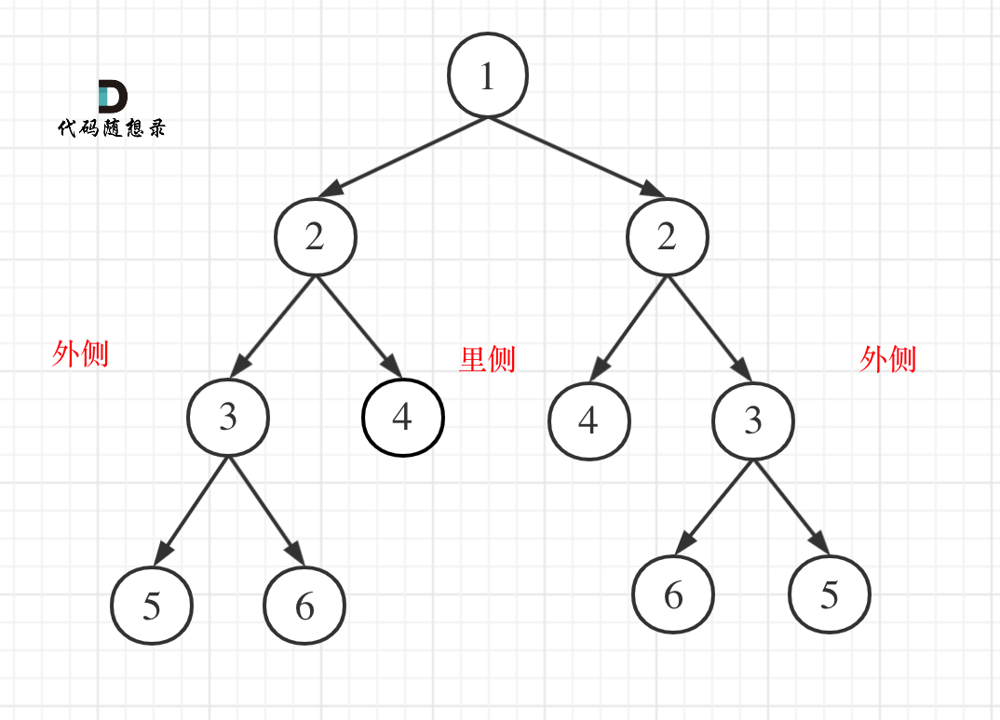

# 101. 对称二叉树

[leecode原题](https://leetcode.cn/problems/symmetric-tree/)

## 题目
给你一个二叉树的根节点 root ， 检查它是否轴对称。

## 示例

### 示例 1:

```text
输入：root = [1,2,2,3,4,4,3]
输出：true
```

### 示例 2:

```text
输入：root = [1,2,2,null,3,null,3]
输出：false
```

## 提示：
- 树中节点数目在范围 `[1, 1000]` 内
- `-100 <= Node.val <= 100`

## 解题思路

### 思路

首先想清楚，判断对称二叉树要比较的是哪两个节点，要比较的可不是左右节点！

对于二叉树是否对称，**要比较的是根节点的左子树与右子树是不是相互翻转的**，理解这一点就知道了其实我们要比较的是两个树（这两个树是根节点的左右子树），**所以在递归遍历的过程中，也是要同时遍历两棵树。**

那么如果比较呢？

**比较的是两个子树的里侧和外侧的元素是否相等**。如图所示：


> 该题的核心就是比较每个子树的里侧和外侧的元素是否相等，也即比较(leftTree.Left, rightTree.Right)和(leftTree.Right, rightTree.left), 然后要注意判断终止条件: 即左右子树为空和非空时候的判断依据。

## 实现

[源码](./code/101-symmetric-tree/main.go)

递归法实现
```go
type TreeNode struct {
	Val   int
	Left  *TreeNode
	Right *TreeNode
}

func compareTree(left *TreeNode, right *TreeNode) bool {
	// 判断节点为空的情况
	if left == nil && right == nil {
		return true
	}
	if left == nil || right == nil {
		return false
	}
	// 节点非空，比较值是否相等
	if left.Val != right.Val {
		return false
	}
	return compareTree(left.Left, right.Right) && compareTree(left.Right, right.Left)
}

// 递归法实现
func isSymmetric(root *TreeNode) bool {
	return compareTree(root.Left, root.Right)
}
```

迭代法实现:
```go
type TreeNode struct {
	Val   int
	Left  *TreeNode
	Right *TreeNode
}

func isSymmetric1(root *TreeNode) bool {
	queue := []*TreeNode{}
	if root != nil {
		queue = append(queue, root.Left, root.Right)
	}
	for len(queue) != 0 {
		left := queue[0]
		right := queue[1]
		queue = queue[2:]
		// 节点为空的情况下
		if left == nil && right == nil {
			continue
		}
		if left == nil || right == nil {
			return false
		}
		// 节点非空的情况下
		if left.Val != right.Val {
			return false
		}
		// 重点步骤!!!思路跟递归其实是类似的
		queue = append(queue, left.Left, right.Right, left.Right, right.Left)
	}
	return true
}
```