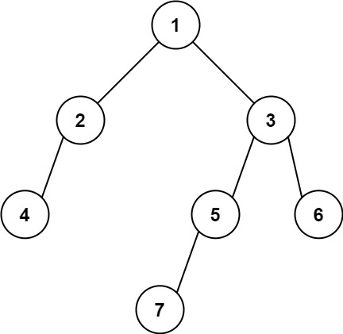

# 513. 找树左下角的值

[leecode原题](https://leetcode.cn/problems/find-bottom-left-tree-value/)

## 题目
给定一个二叉树的 根节点 `root`，请找出该二叉树的 **最底层** **最左边** 节点的值。

**假设二叉树中至少有一个节点。**

## 示例

### 示例 1:

```text
输入: root = [2,1,3]
输出: 1
```

### 示例 2:

```text
输入: [1,2,3,4,null,5,6,null,null,7]
输出: 7
```

## 提示：
- 二叉树的节点个数的范围是 `[1,104]`
- `-231 <= Node.val <= 231 - 1 `

## 解题思路

### 思路

这题可以用层次遍历思路来求解(每遍历一层, 队列中当前第一个元素就是该层最左元素，最后一次遍历就是最底层的最左元素)，可以参阅[二叉树的层序遍历](102-二叉树的层序遍历.md)

## 实现

[源码](./code/513-find-bottom-left-tree-value/main.go)
```go
// 用数组实现个简单的队列功能
type Queue struct {
	elements []*TreeNode
}

func NewQueue() *Queue {
	return &Queue{elements: make([]*TreeNode, 0)}
}

func (q *Queue) Push(node *TreeNode) {
	q.elements = append(q.elements, node)
}

func (q *Queue) Pop() *TreeNode {
	if q.IsEmpty() {
		return nil
	}
	node := q.elements[0]
	q.elements = q.elements[1:]
	return node
}

func (q *Queue) Size() int {
	return len(q.elements)
}

func (q *Queue) IsEmpty() bool {
	if q.Size() == 0 {
		return true
	}
	return false
}

func findBottomLeftValue(root *TreeNode) int {
	if root == nil {
		return 0
	}
	q := NewQueue()
	q.Push(root)
	bottomLeftVal := 0
	for !q.IsEmpty() {
		qSize := q.Size()
		for i := 0; i < qSize; i++ {
			topNode := q.Pop()
			// 队首元素就是该层最左元素
			if i == 0 {
				bottomLeftVal = topNode.Val
			}
			if topNode.Left != nil {
				q.Push(topNode.Left)
			}
			if topNode.Right != nil {
				q.Push(topNode.Right)
			}
		}
	}
	return bottomLeftVal
}
```
