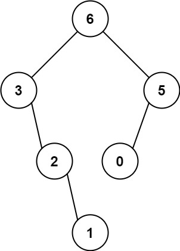

# 654. 最大二叉树

[leecode原题](https://leetcode.cn/problems/maximum-binary-tree/)

## 题目
给定一个**不重复**的整数数组 `nums` 。 最大二叉树 可以用下面的算法从 `nums` 递归地构建:

1. 创建一个根节点，其值为 `nums` 中的最大值。
2. 递归地在最大值**左边**的**子数组前缀上**构建左子树。
3. 递归地在最大值**右边**的**子数组后缀上**构建右子树。

返回 `nums` 构建的**最大二叉树**。

## 示例
### 示例 1:

```text
输入：nums = [3,2,1,6,0,5]
输出：[6,3,5,null,2,0,null,null,1]
解释：递归调用如下所示：
- [3,2,1,6,0,5] 中的最大值是 6 ，左边部分是 [3,2,1] ，右边部分是 [0,5] 。
    - [3,2,1] 中的最大值是 3 ，左边部分是 [] ，右边部分是 [2,1] 。
        - 空数组，无子节点。
        - [2,1] 中的最大值是 2 ，左边部分是 [] ，右边部分是 [1] 。
            - 空数组，无子节点。
            - 只有一个元素，所以子节点是一个值为 1 的节点。
    - [0,5] 中的最大值是 5 ，左边部分是 [0] ，右边部分是 [] 。
        - 只有一个元素，所以子节点是一个值为 0 的节点。
        - 空数组，无子节点。
```

### 示例 2:

```text
输入：nums = [3,2,1]
输出：[3,null,2,null,1]
```

## 提示：
- `1 <= nums.length <= 1000`
- `0 <= nums[i] <= 1000`
- `nums` 中的所有整数**互不相同**

## 解题思路

### 思路

该题理解后，其实也是比较简单的，每次找到数组中的最大值索引，然后以该索引为切割点继续将数组一分为二，递归切分后的左右数组分别形成左右子树即可。

## 实现

[源码](./code/654-maximum-binary-tree/main.go)
```go
func constructMaximumBinaryTree(nums []int) *TreeNode {
	// 数组为空，终止
	if len(nums) == 0 {
		return nil
	}
	maxIndex := findMaxValIndex(nums)
	// 将数组一分为二, 依次递归
	root := &TreeNode{
		Left:  constructMaximumBinaryTree(nums[:maxIndex]),
		Right: constructMaximumBinaryTree(nums[maxIndex+1:]),
		Val:   nums[maxIndex],
	}
	return root
}

// 找寻最大值的下标
func findMaxValIndex(nums []int) (index int) {
	if len(nums) == 0 {
		return -1
	}
	max := nums[0]
	for i := 1; i < len(nums); i++ {
		if nums[i] > max {
			max = nums[i]
			index = i
		}
	}
	return index
}
```
